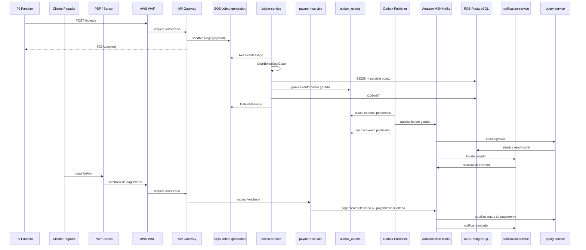

# Arquitetura AWS - Received Bank Services

Este projeto possui uma base AWS alinhada ao diagrama publicado em `received-bank-services/docs/assets/aws-reference-architecture.svg`.

## Mapeamento

| Camada | Local | AWS |
| --- | --- | --- |
| Entrada de criacao de boleto | Docker/REST local | PJ Parceiro passa por WAF/API Gateway, que publica em SQS |
| Entrada de retorno de pagamento | Endpoint simulador local | Cliente Pagador paga em PSP/Banco externo, que retorna webhook via WAF/API Gateway |
| Entrada de consulta | Docker ports locais | ALB Ingress no EKS para `query-service` |
| Compute | Containers Docker Compose | EKS |
| Imagens | Build local | ECR por microservico |
| Banco write/read model | PostgreSQL container | RDS PostgreSQL |
| Cache/idempotencia | Redis container | ElastiCache Redis |
| Fila de entrada | Nao local | SQS `boleto-generation` + DLQ |
| Event bus | Redpanda Kafka | Amazon MSK |
| Objetos/PDFs/backups | Nao local | S3 |
| Segredos | Variaveis locais | Secrets Manager + Kubernetes Secret |
| Logs/metricas | Logs locais / Actuator | CloudWatch + Actuator/Prometheus |
| Alertas | Nao local | SNS/SES |

## Desenho executivo

Visao horizontal, da esquerda para a direita, alinhada ao desenho Draw.io publicado:

```mermaid
flowchart LR
    subgraph A["Atores externos"]
        direction TB
        PJ[PJ Parceiro<br/>emite boleto]
        Pagador[Cliente Pagador<br/>paga boleto]
        PSP[PSP / Banco<br/>processa pagamento]
    end

    subgraph B["Borda segura"]
        WAF[AWS WAF<br/>protecao + rate limit]
        APIGW[API Gateway<br/>auth + throttling + routing]
    end

    subgraph L1["Fluxo A - Emissao do boleto"]
        direction LR
        BoletoIn[SQS boleto-generation]
        BoletoSvc[boleto-service<br/>gera boleto + outbox]
        RDSWrite[(RDS PostgreSQL<br/>write model + outbox)]
        S3[(S3<br/>PDFs de boleto)]
        OutboxRelay[outbox-worker<br/>publica MSK]
    end

    subgraph L2["Fluxo B - Pagamento do boleto"]
        direction LR
        PaymentSvc[payment-service<br/>valida / efetiva pagamento]
        Redis[(ElastiCache Redis<br/>idempotencia)]
    end

    subgraph L3["Eventos e efeitos"]
        direction LR
        MSK[(Amazon MSK<br/>boleto.gerado<br/>pagamento.*<br/>notificacao.enviada)]
        QuerySvc[query-service<br/>consume eventos]
        NotificationSvc[notification-service<br/>consume eventos]
        SNS[SNS / SES<br/>webhook / e-mail / SMS]
        RDSRead[(RDS PostgreSQL<br/>read model CQRS)]
    end

    subgraph G["Servicos gerenciados AWS"]
        direction TB
        CW[CloudWatch<br/>logs / metricas / alarmes]
        Secrets[Secrets Manager<br/>credenciais]
        IAM[IAM + IRSA<br/>least privilege]
        ECR[ECR<br/>imagens Docker]
    end

    subgraph F["Falhas controladas"]
        direction TB
        BoletoDLQ[SQS DLQ boleto-generation]
        KafkaDLT[Kafka DLT<br/>por consumer]
    end

    PJ -->|POST /boletos| WAF --> APIGW
    Pagador -->|paga boleto| PSP
    PSP -->|webhook pagamento| WAF

    APIGW -->|POST /boletos<br/>202 Accepted| BoletoIn
    BoletoIn -->|long polling| BoletoSvc
    BoletoIn -.falha.-> BoletoDLQ

    BoletoSvc -.PDF.-> S3
    BoletoSvc -->|ACID + outbox| RDSWrite
    RDSWrite -->|eventos pendentes| OutboxRelay
    OutboxRelay -.boleto.gerado.-> MSK

    MSK -.consume boleto/pagamento.-> NotificationSvc
    NotificationSvc --> SNS
    SNS -.notifica emissao / pagamento.-> PJ
    MSK -.consume eventos.-> QuerySvc
    QuerySvc -->|projecao CQRS| RDSRead

    APIGW -->|routes /webhook| PaymentSvc
    PaymentSvc -.Idempotency-Key.-> Redis
    PaymentSvc -->|atualiza status| RDSWrite
    PaymentSvc -.pagamento.efetivado / rejeitado.-> MSK
    MSK -.falha de consumo.-> KafkaDLT

    classDef actor fill:#eef6ff,stroke:#2563a8,color:#172033;
    classDef gateway fill:#fff8ea,stroke:#b7791f,color:#172033;
    classDef entry fill:#f7fff9,stroke:#17865a,color:#172033;
    classDef service fill:#ffffff,stroke:#64748b,color:#172033;
    classDef data fill:#eef2ff,stroke:#4f46e5,color:#172033;
    classDef event fill:#fff1f8,stroke:#db2777,color:#172033;
    classDef failure fill:#fff1f2,stroke:#be123c,color:#172033;

    class PJ,Pagador,PSP actor;
    class WAF,APIGW gateway;
    class BoletoIn entry;
    class BoletoSvc,PaymentSvc,NotificationSvc,QuerySvc service;
    class RDSWrite,RDSRead,Redis,S3 data;
    class OutboxRelay service;
    class MSK,SNS event;
    class BoletoDLQ,KafkaDLT failure;
    class CW,Secrets,IAM,ECR service;
```

## Desenho simplificado

Versao curta para slide ou explicacao rapida:

```text
PJ Parceiro
  -> WAF
  -> API Gateway
  -> SQS boleto-generation
  -> boleto-service no EKS
  -> RDS PostgreSQL + outbox_events + S3
  -> outbox-worker
  -> Amazon MSK
  -> notification-service / query-service

Cliente Pagador
  -> PSP / Banco externo
  -> WAF
  -> API Gateway webhook
  -> payment-service
  -> RDS PostgreSQL + ElastiCache Redis
  -> Amazon MSK
  -> query-service / notification-service
  -> SNS / SES
  -> CloudWatch + Tracing + Alertas
```

## Boas praticas representadas

| Pratica | Onde aparece no desenho |
| --- | --- |
| Entrada resiliente | API Gateway retornando `202 Accepted` e SQS absorvendo pico |
| Retry e DLQ na entrada | SQS + `boleto-generation-dlq` |
| Pagamento como estimulo externo | Cliente Pagador paga no PSP/Banco externo, que envia webhook pela borda segura |
| Idempotencia | `Idempotency-Key` validada no Redis |
| ACID | Gravacao do boleto no RDS PostgreSQL |
| Consistencia banco/evento | Transactional Outbox com tabela `outbox_events` |
| Desacoplamento | MSK Kafka para eventos de dominio |
| DLQ por consumer | Kafka DLT por servico consumidor |
| Segurança | WAF, API Gateway Auth, Secrets Manager, IAM/IRSA |
| Observabilidade | CloudWatch, tracing distribuido e alertas |

## Fluxo principal AWS



## Recursos criados por Terraform

Pasta: `infra/aws/terraform`

- VPC com subnets publicas e privadas
- Internet Gateway e NAT Gateway
- Security Groups para EKS e dados
- EKS Cluster e node group
- ECR para `boleto-service`, `query-service`, `payment-service`, `notification-service`
- RDS PostgreSQL
- ElastiCache Redis
- SQS para entrada de geracao de boletos
- SQS DLQ para mensagens com falha
- API Gateway REST API integrado diretamente com SQS
- Amazon MSK
- S3 para documentos/PDFs e backups
- SNS para alertas
- Secrets Manager para credenciais
- CloudWatch Log Groups

Observacao: o webhook de retorno de pagamento do PSP/Banco externo foi adicionado ao desenho de solucao como arquitetura alvo. O Terraform ainda precisa ser refinado em uma etapa posterior para provisionar essa rota/canal de integracao.

## Manifests Kubernetes AWS

Pasta: `k8s/aws`

- `namespace.yaml`
- `configmap.yaml`
- `secret.example.yaml`
- `boleto-service.yaml`
- `query-service.yaml`
- `payment-service.yaml`
- `notification-service.yaml`
- `ingress-alb.yaml`

## Fluxo de deploy

1. Criar um arquivo de variaveis:

```bash
cd infra/aws/terraform
cp terraform.tfvars.example terraform.tfvars
```

2. Editar `terraform.tfvars`, principalmente `db_password`.

3. Criar a infraestrutura na AWS com as credenciais configuradas no ambiente local:

```bash
terraform init
terraform plan
terraform apply
```

> Atenção: `terraform apply` usa a conta AWS ativa de quem executa o comando. Os recursos provisionados podem gerar custos.

4. Configurar acesso ao EKS:

```bash
aws eks update-kubeconfig --region us-east-1 --name received-bank-dev-eks
```

5. Buildar e publicar imagens no ECR usando os repositórios do output `ecr_repositories`.

6. Atualizar os campos `image:` em `k8s/aws/*-service.yaml` com as URLs do ECR.

7. Criar o secret Kubernetes com os outputs do Terraform:

```bash
cp k8s/aws/secret.example.yaml k8s/aws/secret.yaml
```

Preencher:

- `RDS_ENDPOINT`
- `REDIS_ENDPOINT`
- `MSK_BOOTSTRAP_SERVERS`
- `BOLETO_GENERATION_QUEUE_URL`
- `AWS_S3_DOCUMENTS_BUCKET`
- `AWS_SNS_ALERTS_TOPIC_ARN`

8. Aplicar manifests:

```bash
kubectl apply -f k8s/aws/namespace.yaml
kubectl apply -f k8s/aws/configmap.yaml
kubectl apply -f k8s/aws/secret.yaml
kubectl apply -f k8s/aws/boleto-service.yaml
kubectl apply -f k8s/aws/query-service.yaml
kubectl apply -f k8s/aws/payment-service.yaml
kubectl apply -f k8s/aws/notification-service.yaml
kubectl apply -f k8s/aws/ingress-alb.yaml
```

## Observacoes

- O projeto continua com `docker-compose.yml` para desenvolvimento local.
- Na AWS, criacao de boleto entra por API Gateway e SQS; Kafka/MSK continua como event bus interno apos a geracao do boleto.
- O ALB Ingress fica focado em consultas do `query-service`.
- S3 e SNS/SES estao provisionados para a evolucao de PDFs, backups e alertas, mas a logica de negocio atual ainda esta focada no fluxo Kafka.
- Para producao real, o proximo refinamento recomendado e instalar/configurar o AWS Load Balancer Controller, External Secrets Operator e IRSA por service account em vez de permissao ampla no node role.
